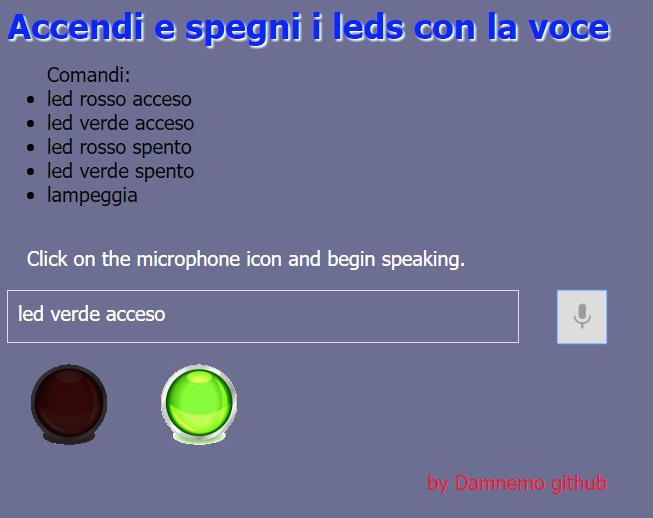

SPEECH API
====================

Test dell'uso delle API di google "web speech",
con comandi per accedere e spegnere dei led (png).

More info about APIs:
https://dvcs.w3.org/hg/speech-api/raw-file/tip/speechapi.html

	git clone git@github.com:damnemo/Speech_API.git
	git clone git://github.com:damnemo/Speech_API.git

## Per poter utilizzare le Web Speech API
## su pc in locale due sono le soluzioni

1) è necessario creare un local webserver.

	Esempio webserver con python:
	-	 download e installazione di python 3
	-	 aprire il terminale dalla directory dove sono inclusi i file html
	-	 digitare "python -m http.server 8000"
	-	 aprire il browser all'indirizzo "http://localhost:8000/"

2) opzione di chrome

	chiudere il browser chrome
	Per Windows:
		cliccare tasto dx su chrome.exe 
		su destinazione copiare -> "C:\Program Files (x86)\Google\Chrome\Application\chrome.exe" --disable-web-security
		vedi link "chrome_local_test"
	Per Linux:
		da terminale "chrome --disable-web-security"

### Image Preview

